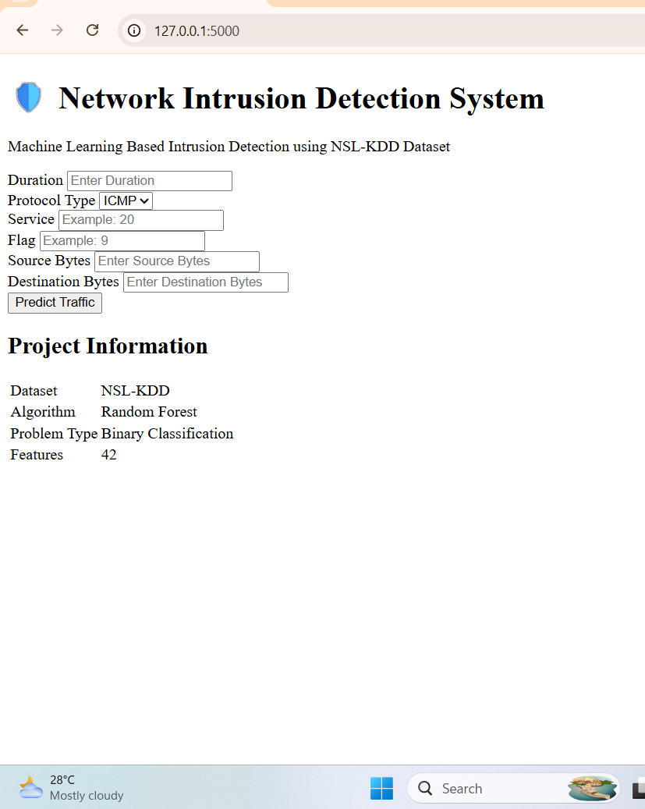
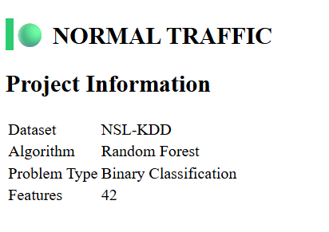
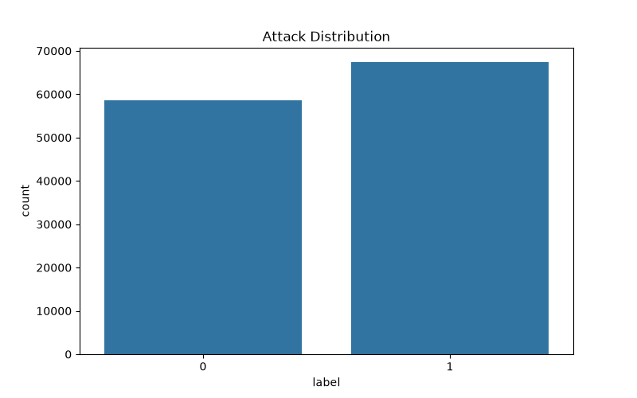
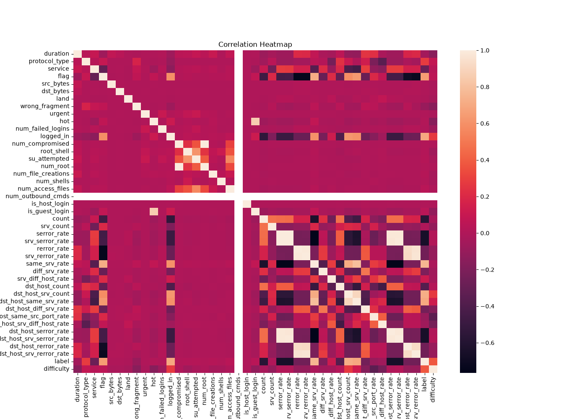
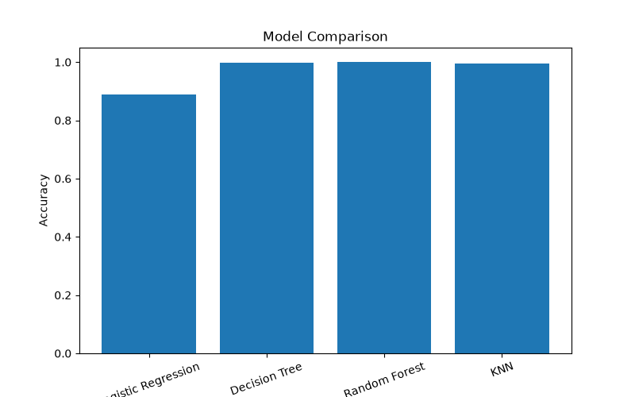

# 🛡️ Network Intrusion Detection System using Machine Learning

A Machine Learning-based Network Intrusion Detection System (NIDS) developed using the NSL-KDD dataset. The project detects whether network traffic is **Normal** or an **Intrusion (Attack)** using supervised machine learning algorithms and provides predictions through a Flask web application.

---

## 📌 Project Overview

Network Intrusion Detection Systems help identify malicious activities within a computer network. This project applies multiple Machine Learning algorithms to classify network traffic and detect potential cyber attacks.

The best-performing model is saved and deployed using Flask to provide real-time predictions through a user-friendly web interface.

---

## 🚀 Features

- Data preprocessing and cleaning
- Exploratory Data Analysis (EDA)
- Binary classification (Normal vs Attack)
- Multiple Machine Learning models
  - Random Forest
  - Decision Tree
  - Logistic Regression
  - K-Nearest Neighbors (KNN)
- Model comparison based on accuracy
- Automatic graph generation
- Flask web application for prediction
- Professional project structure

---

## 📂 Project Structure

```
Network-Intrusion-Detection-System
│
├── data/
│   ├── KDDTrain+.txt
│   └── KDDTest+.txt
│
├── graphs/
│   ├── attack_distribution.png
│   ├── protocol_distribution.png
│   ├── correlation_heatmap.png
│   └── model_comparison.png
│
├── models/
│   └── network_intrusion_model.pkl
│
├── static/
│   └── style.css
│
├── templates/
│   └── index.html
│
├── app.py
├── train_model.py
├── requirements.txt
└── README.md
```

---

## 🗂️ Dataset

This project uses the **NSL-KDD Dataset**, a widely used benchmark dataset for intrusion detection research.

Dataset Files:

- KDDTrain+.txt
- KDDTest+.txt

---

## ⚙️ Technologies Used

- Python
- Flask
- Pandas
- NumPy
- Scikit-learn
- Matplotlib
- Seaborn
- Joblib
- HTML
- CSS

---

## 🤖 Machine Learning Algorithms

The following algorithms were trained and compared:

- Random Forest
- Decision Tree
- Logistic Regression
- K-Nearest Neighbors (KNN)

The best-performing model was selected automatically and saved for deployment.

---

## 📊 Exploratory Data Analysis

The project generates the following visualizations:

- Attack Distribution
- Protocol Distribution
- Correlation Heatmap
- Model Accuracy Comparison

All graphs are automatically saved inside the **graphs/** folder.

---

## 🌐 Web Application

The project includes a Flask-based web application that allows users to enter network traffic information and receive predictions indicating whether the traffic is normal or potentially malicious.

---

## ▶️ Installation

Clone the repository

```bash
git clone https://github.com/your-username/Network-Intrusion-Detection-System.git
```

Move into the project directory

```bash
cd Network-Intrusion-Detection-System
```

Install dependencies

```bash
pip install -r requirements.txt
```

---

## ▶️ Run Model Training

```bash
python train_model.py
```

---

## ▶️ Run Flask Application

```bash
python app.py
```

Open your browser and visit

```
http://127.0.0.1:5000
```

---

## 📈 Results

- Successful preprocessing of the NSL-KDD dataset
- Comparison of multiple machine learning algorithms
- Best model selected automatically
- Flask deployment for real-time prediction
- Graphical analysis of dataset and model performance

---
## 📸 Project Screenshots

### Home Page


### Prediction Result


### Attack Distribution


### Correlation Heatmap


### Model Comparison


---

## 🔮 Future Enhancements

- Deep Learning based Intrusion Detection
- Real-time network packet capture
- Live traffic monitoring
- Explainable AI (XAI)
- Cloud deployment
- Docker containerization

---

## 👩‍💻 Author

**Srishti Sharma**

Machine Learning Intern - https://www.codtechitsolutions.com/
- Intern ID - CITS3980

---

## 📜 License

This project is developed for educational and internship purposes.
